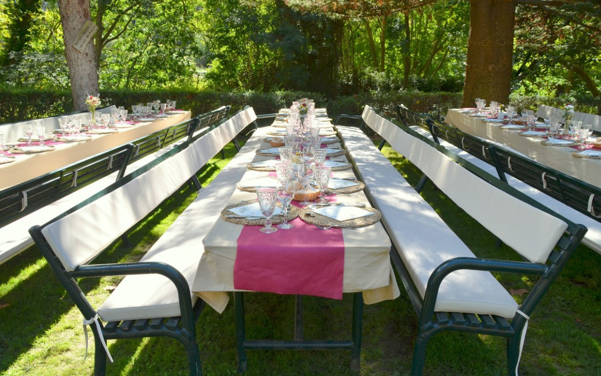

<script> 
    $(document).ready(function() { 
    $head = $('#header'); 
    $head.prepend('<A href = https://www.cuttingedge-events.com></A>') 
    }); 
</script> 


```{r setup, include=FALSE}
knitr::opts_chunk$set(echo = FALSE, message=FALSE, warning=FALSE)
```


```{r libraries}
library(readxl)
library(dplyr)
library(knitr)
library(timevis)

```

# Accommodation

## Main Hotel: Nixe Palace

<iframe src="NIXE PALACE/NIXE PALACE.html" frameborder="0" width="100%" height="1200" scrolling="no"></iframe>

</br>

**Rates**

<div class="budget">

<p> 
  <ul>
   * Twin room, including breakfast 280€ VAT inc (rates per room and night)
   
   *The hotel has 36 twin rooms (separated beds)*
   
* Touristic tax: 4,4€ VAT inc per person and night
   
   *If we contract a minimum if 35  rooms, the hotel will offer 1 room foc for Maximice staff and 1 upgrade foc*
   
* Lunch menus, including non alcoholic drinks from: 53€ VAT inc 

  </ul>
</p>

</div>

<style>

.budget{
background-color: #607D8B;
color: white;
padding: 10px;
border: 1px solid black;
margin-left: 5px;
border-radius: 5px;
font-style: italic;
}
</style>

<br>
<br>

Discover the hotel yourself:

<iframe width="100%" height="400" src="https://www.youtube.com/embed/X4h1_6X1uyk" frameborder="0" allow="accelerometer; autoplay; encrypted-media; gyroscope; picture-in-picture" allowfullscreen></iframe>
<br>
<br>


## Alternative Hotels {.tabset .tabset-fade .tabset-pills}

### Gran Melia Victoria

<iframe src="GRAN MELA VICTORIA/GRAN MELIA VICTORIA.html" frameborder="0" width="100%" height="1200" scrolling="no"></iframe>
</br>


**Rates**

<div class="budget">

<p> 
  <ul>
   * Double room for single use, including breakfast: 223€ VAT inc (rates per room and night)
  
   * Twin room, including breakfast 243€ VAT inc (rates per room and night)
   
   *Separated beds*
   
* Touristic tax: 4,4€ VAT inc per person and night

* Lunch menus, including non alcoholic drinks from: 53€ VAT inc 

* Gala dinner menu, including drinks (red and white wine, water and coffee)from: 75€ VAT inc

  </ul>
</p>

</div>

</br>
</br>

*****

### Castillo Son Vida

<iframe src="CASTILLO DE SON VIDA/CASTILLO DE SON VIDA.html" frameborder="0" width="100%" height="1100" scrolling="no"></iframe>
</br>


**Rates**

<div class="budget">

<p> 
  <ul>
* Double room for single use, including breakfast: 290€ VAT inc (rates per room and night)
  
* Twin room, including breakfast 340€ VAT inc (rates per room and night)
   
   *Separated beds*
   
* Touristic tax: 4,4€ VAT inc per person and night

* Lunch menus, including non alcoholic drinks from: 56,50€ VAT inc 

* Gala dinner menu, including drinks (red and white wine, water and coffee)from: 90€ VAT inc

  </ul>
</p>
</div>

*These rates are valid only with a minimum expense of 215€ per person in F&B *

</br>
</br>

*****

### Palma Bellver Melia

<iframe src="PALMA BELLVER MELIA/PALMA BELLVER MELIA.html" frameborder="0" width="100%" height="1200" scrolling="no"></iframe>
</br>

**Rates**

<div class="budget">

<p> 
  <ul>
* Double room for single use, including breakfast: 150€ VAT inc (rates per room and night)
  
* Twin room, including breakfast 162€ VAT inc (rates per room and night)
   
   *Separated beds*
   
* Touristic tax: 3,3€ VAT inc per person and night

* Lunch menus, including non alcoholic drinks from: 35€ VAT inc 

* Gala dinner menu, including drinks (red and white wine, water and coffee)from: 56,50€ VAT inc

  </ul>
</p>
</div>

</br>
</br>

*****


# Activities {.tabset .tabset-fade .tabset-pills}

## Catamaran sailing and BBQ

At 9.45h Our guests will be transferred by bus to Palma's Port where they will find the Taïti Catamaran.
They will have the catamaran in exclusive for them. It is a big catamaran with 22,80m long and a capacity for 100 pax.

From 10.00h to 15.00h they will enjoy a sailing activity.
The catamaran has toilets and showers, so guests will be able to take a shower after they swim on the sea.


**Rates**

<div class="budget">

<p> 
  <ul>
* Sailing activity from 10h to 15h: 3000€ VAT inc

* Welcome drink including a glass of cava or sangria and some snacks: 12€ VAT per person

* BBQ menu including grilled pork and chiken meat, bread, fresh salad buffet (including pasta and potato salad), fruit and pastries, from 25€ VAT inc

* Extra to add Grilled vegetables: 4€ per person VAT inc

* Open Bar (during the whole activity) including water, soft drinks, wine, cava, sagria, beer and coffee: 17€ VAT inc per person

* Water Activities: Banana, donuts, etc - during 3 hours guests will have the oportunity to try one or all these funny toys: 1300€ VAT inc

* 2 x 50 seater bus 5 hours at disposal for the activity: 1240€ VAT inc

* 1 x Russian speaking assistant: 295€ VAT inc

  </ul>
</p>
</div>

</br>
</br>


## Sierra de Tramontana excursion

Our Russian speaking guides will pick up guests at the hotel, we will have two buses with capacity for 50 pax each. We will split guests but the buses will do the same route and inside each bus one russian spekaing guide will explain them the history of the area.

They will go to Valldemossa, a beautiful and tradicional village located in the mountains.They will visit La Cartuja inside.


After the visit, they will go to Soller. Another beautiful village where they will see one of the oldests trams of Spain. It is a wooden tram that goes to Port Soller trough olives and oranges fields.


And once in Port Soller they will enjoy the relax of this village facing to the sea.


Optionally, they will have lunch on a terrace with wonderful seaviews.


**Rates**

<div class="budget">

<p> 
  <ul>
* Excursion including two 50 seater buses, 2 Russian speaking guide, 2 small bottles of water per person and headphones: 40€ VAT per person for a group of 70 pax minimum. 

* Optional extra guide: 295€ VAT inc 

* Optional:Lunch: 3 courses menu including drinks and coffee, from 50€ VAT inc

  </ul>
</p>
</div>

</br>
</br>

## Back to traditions

We suggest a visit La Granja Museum in Esporlas and enjoy a showcooking paella lunch.


La Granja d'esporlas is the museum of Malloca's traditions and history. It is located 15km from Palma in the Serra de tramuntana mountains. La Granja is a beautiful 17th-century mansion surrounded by lush vegetation, gardens and natural springs, with a Majorican restaurant and a terrace café that guests will not want to leave.

Guests will enjoy themselves while learning about traditional crafts, watching live demonstrations and knowing the farm animals.


</br>

After the visit and tasting some traditional products, guests will go to the garden area where they will find the professional chefs cooking big paellas. They will enjoy some drinks while they can see how the paella is elaborated.

Then they will eat a 3 courses menu with the paella as main course.




</br>

In case of bad weather La Granja has different rooms where the lunch can be served


**Rates**

<div class="budget">

<p> 
  <ul>
* Excursion including two 50 seater buses, 2 Russian speaking guide, 2 small bottles of water per person and headphones: 40€ VAT per person for a group of 70 pax minimum.

* Visit La Granja and tasting some traditional products: 20€ per pax VAT inc

* Optional: Paella show-cooking menu, including drinks from: 50€ VAT inc per person

  </ul>
</p>
</div>

</br>
</br>


## Guided Shopping day in Palma

Palma has everything that a shopping paradise needs. The main shopping streets are in the old town,just above the cathedral. 

The three-lined, luxurious **Paseo del Borne**, one of the most important shopping hubs, offer mainly designer stores. St the end of Paseo del Borne there is **Avenida de Jaume III**


Here guests can buy fashonable clothes, shoes and other accessories of any price range. 

In the center of the old town of Palma, shopping fans will find more stores around **Plaça Major**


Our Russian speaking guides will pick up the group at the hotel, for this Shopping day we recommend to split guests in small groups of 15 pax maximum.  The bus will transfer them to the city centre where they will start their tour.


Between shop and shop, we would suggest to do a stop in one of the traditional tapas bar to have one glass of wine (or soft-drink) and two tapas.

</br>

**Rates**

<div class="budget">

<p> 
  <ul>
* 2 x 50 seater bus 5 hours at disposal for the activity: 1240€ VAT inc

* 1 x Russian speaking guide: 295€ VAT inc * 5: 1475€ VAT inc

* Stop for a glass of wine and 2 tapas: 25€ per person VAT inc

  </ul>
</p>
</div>


</br>
</br>

# Gala dinner

## Main Venue: Hotel Nixe Palace

In June the group can enjoy the perfect welcome drink at the hotel's terrace, around the pool and with beautiful sea views.


The Gala dinner will be set atHotel Nixe's Gala dinning room called Salon de Las Arenas. It has direct access to the terrace and wonderful sea views.

Las Arenas room has a capacity for 100 pax, it will be room enough to set a stage and an area to dance.


</br>

**Rates**

<div class="budget">

<p> Gala Dinner Menu from: 99,50€ VAT inc
  <ul>
* Welcome cocktail - 30 minutes duration - including 6 appetizers and drinks

* Seated dinner menu including 3 courses, drinks (red and white wine, cava and mineral water) and coffee

  </ul>
  
*These rates are including Las Arenas room rental for the Gala Dinner*

</p>
</div>

</br>
</br>


## Theme dinner options {.tabset .tabset-fade .tabset-pills} 

### Spanish Night

Guests will be transported to a typical Spanish party, in an environment full of light and passion.

**Decoration:** 

  * Traditional lanterns, flowers and colour cloths.
  
  * Thematic Photocall including atrezzo - that will be used by guests during the welcome drink
  
  * Garlands and small lanterns.
  


  
**Artists**

  * 2 Flamenco dancers with the traditional dress will welcome guests 
  
  * A Spanish guitarrist will play during the welcome drink
  
  * Flamenco Show during dinner, including one singer, Spanish guitar, Percussion and 2 flamenco dancers. The show is divided in different parts, the artists will change their dresses.
  
  
  
  * Flamenco Masterclass, after the dessert and before the party, our dancers will invite guests to dance with them. This is always a very funny moment, guests have a great time.
  


  
**Party**

  * DJ with Spanish and international music. 
 
 

**Rates**

<div class="budget">

<p> **Spanish Night - 8.500€ VAT inc**

This is a package including:
  <ul>
* Decoration
* Artists
* Stage, sound system and lights
* DJ

  </ul>
</p>

*These rates are valid only for Hotel Nixe Palace - Las Arenas dining room, we can organize the same thematic party in any other venue but we would need to adjust the quotation depending on the size, if it is indoor or outdoor, etc*
</div>

</br>
</br>


### Cabaret-Moulin Rouge

We will organize a "Belle epoque" party, very elegant but sensual, our guests will be transported to the Moulin Rouge.

**Decoration**

  * Red, black and golden cloths
  * Thematic Photocall with attrezo - will be used during the welcome drink -
  * Giant bubble cannon
  
 
  
**Artists**

  * 2 artists with thematic dresses and stilts will welcome guests
  * Short Circus shows will be played during the welcome cocktail
  * Drag Queen Show, with music, dance and dressing changes. Artist with a great international career.
  
   

  
**Party**

  * Dj who will play Spanish and international music
  * 2 Gogós with themed dresses.
  
**Rates**

<div class="budget">

<p> **Cabaret-Mouline Rouge Night - 10.500€ VAT inc**

This is a package including:
  <ul>
* Decoration
* Artists
* Stage, sound system and lights
* DJ

  </ul>
</p>

*These rates are valid only for Hotel Nixe Palace - Las Arenas dining room, we can organize the same thematic party in any other venue but we would need to adjust the quotation depending on the size, if it is indoor or outdoor, etc*
</div>

</br>
</br>


## Other services

**Phorographer services**

<iframe width="100%" height="450" src="https://www.youtube.com/embed/7yAuG7wwgmQ" frameborder="0" allow="accelerometer; autoplay; encrypted-media; gyroscope; picture-in-picture" allowfullscreen></iframe>


<div class="budget">

<p> Gala dinner service (from 18.00h to 22.00h): 650€ VAT inc

  <ul>
* one photographer
* Unlimited digital pictures
* Delivered via wetransfer or dropbox 3 days after the event
* Service during the welcome drink and the seated dinner.

  </ul>
</p>

*These rates are valid for any of the venue options*
</div>

</br>
</br>


*****

## Alternative Venue {.tabset .tabset-fade .tabset-pills}

### Palace in Palma Centre

For this special evening, as an option to HOtel Nixe Palace we suggest a beautiful venue located in Palma city centre.

We would welcome guests with a cocktail in the patio, it has a special atmosphere full of history.

   

After the welcome drink guests will go inside, to discover the magnificient room where they will have dinner.

 

</br>

**Rates**

<div class="budget">

<p> Venue rental *(the building is huge, so the group will have only the 2 spaces in exclusive but they can be other events in other areas of the builidng)*

  <ul>
* Patio and Chapel room: 9000€ VAT inc

  </ul>
</p>

<p> Gala Menu (Catering) from: 140€ VAT inc per person

  <ul>
* Staff (chefs, waiters, etc)
* Furniture
* White Table cloth
* Chiavari chairs
* Chosen menu
* Welcome cocktail
* Drinks

  </ul>
</p
</div>

</br>
</br>


# Transfers


**Rates**

<div class="budget">

<p> Buses:
  <ul>
* 50 seater bus transfer from Palma Airport to Nixe Palace hotel: 282€ VAT inc *(we recommend to use 2 x 50 seater buses to have room enough for the luggage)*

* 50 seater bus 4hours at disposal for dinner: 650€ VAT inc

* 30 seater bus 4 hours at disposal for dinner: 565€ VAT inc

  </ul>
</p>

<p> Private VIP transfers:
  <ul>
* Mercedes S Class or BMW serie 7 (maximum 4 pax) - transfer from the Airport to Nixe Palace: 103€ VAT inc

* Mercedes Viano (Max 7 pax) - transfer from the Airport to Hotel Nixe Palace: 135€ VAT inc

* Mercedes S Class or BMW serie 7 (maximum 4 pax) - 4 hours at disposal for dinner: 508€ VAT inc

* Mercedes Viano (Max 7 pax) - 4 hours at disposal for dinner: 567€ VAT inc

  </ul>
</p>

<p> Russian speaking assistant:
  <ul>
* Meet and greet at the Airport, transfer and assistance during check in: 250€ VAT inc

  </ul>
</p>
</div>

</br>
</br>

# Terms & Conditions

  * Rates valid for 2020.
  
  * Net rates for Maximice
  
  * For a group of minimum 70 pax.
  
  * Cutting Edge Events management fee including in the detailed rates
  
  * VAT included. 
  
  * No reservation has been done. Availability upon request.

# Amaze your clients!!

<div class="client_offer">

<p>Didn't you just love our presentation ? Our first goal here at _**Cutting Edge Events**_ is to help you **win** this business. You will most likely now collate the information contained in this website and make your own presentation
to show your client<br>

<p>Why not leverage our technology, and present your client with the same format ? As a **totally free service**, we offer you the possibility of doing the work for you</p>

<p> We will: 
  <ul>
    * Follow your instructions to add anything you want to be in your presentation, and delete anything that you don't consider relevant
    
* Include your logo and company details, and remove all our company details

* We can even change some colors to mimic your corporate identity
  
* We will send you the new link, and it will look as if it was your work

  </ul>
</p>
</div>

<style>

.client_offer{
background-color: #ee7600;
color: white;
padding: 10px;
border: 1px solid black;
margin-left: 25px;
margin-right: 25px;
border-radius: 10px;
font-style: italic;
}
</style>

******************


